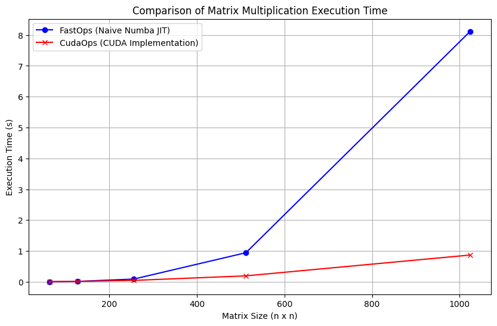

# MiniTorch Module 3


## Task 1: Parallelization

Diagnostics output from `project/parallel_check.py`:

````bash
MAP

================================================================================
 Parallel Accelerator Optimizing:  Function tensor_map.<locals>._map, /Users/str
aberry_yogurt_tart/Desktop/CS5781/mod3-ruitian1212/minitorch/fast_ops.py (164)
================================================================================


Parallel loop listing for  Function tensor_map.<locals>._map, /Users/straberry_yogurt_tart/Desktop/CS5781/mod3-ruitian1212/minitorch/fast_ops.py (164)
-----------------------------------------------------------------------------------------|loop #ID
    def _map(                                                                            |
        out: Storage,                                                                    |
        out_shape: Shape,                                                                |
        out_strides: Strides,                                                            |
        in_storage: Storage,                                                             |
        in_shape: Shape,                                                                 |
        in_strides: Strides,                                                             |
    ) -> None:                                                                           |
        out_size: int = len(out)                                                         |
                                                                                         |
        if np.array_equal(out_strides, in_strides) and np.array_equal(                   |
            out_shape, in_shape                                                          |
        ):                                                                               |
            for i in prange(out_size):---------------------------------------------------| #2
                out[i] = fn(in_storage[i])                                               |
        else:                                                                            |
            for i in prange(out_size):---------------------------------------------------| #3
                out_index = np.zeros(MAX_DIMS, dtype=np.int32)---------------------------| #0
                in_index = np.zeros(MAX_DIMS, dtype=np.int32)----------------------------| #1
                to_index(i, out_shape, out_index)                                        |
                broadcast_index(out_index, out_shape, in_shape, in_index)                |
                mapped_data = fn(in_storage[index_to_position(in_index, in_strides)])    |
                out[i] = mapped_data                                                     |
--------------------------------- Fusing loops ---------------------------------
Attempting fusion of parallel loops (combines loops with similar properties)...

Fused loop summary:
+--0 has the following loops fused into it:
   +--1 (fused)
Following the attempted fusion of parallel for-loops there are 3 parallel for-
loop(s) (originating from loops labelled: #2, #3, #0).
--------------------------------------------------------------------------------
---------------------------- Optimising loop nests -----------------------------
Attempting loop nest rewrites (optimising for the largest parallel loops)...

+--3 is a parallel loop
   +--0 --> rewritten as a serial loop
--------------------------------------------------------------------------------
----------------------------- Before Optimisation ------------------------------
Parallel region 0:
+--3 (parallel)
   +--0 (parallel)
   +--1 (parallel)


--------------------------------------------------------------------------------
------------------------------ After Optimisation ------------------------------
Parallel region 0:
+--3 (parallel)
   +--0 (serial, fused with loop(s): 1)


Parallel region 0 (loop #3) had 1 loop(s) fused and 1 loop(s) serialized as part
 of the larger parallel loop (#3).
--------------------------------------------------------------------------------
--------------------------------------------------------------------------------

---------------------------Loop invariant code motion---------------------------
Allocation hoisting:
The memory allocation derived from the instruction at /Users/straberry_yogurt_ta
rt/Desktop/CS5781/mod3-ruitian1212/minitorch/fast_ops.py (181) is hoisted out of
 the parallel loop labelled #3 (it will be performed before the loop is executed
 and reused inside the loop):
   Allocation:: out_index = np.zeros(MAX_DIMS, dtype=np.int32)
    - numpy.empty() is used for the allocation.
The memory allocation derived from the instruction at /Users/straberry_yogurt_ta
rt/Desktop/CS5781/mod3-ruitian1212/minitorch/fast_ops.py (182) is hoisted out of
 the parallel loop labelled #3 (it will be performed before the loop is executed
 and reused inside the loop):
   Allocation:: in_index = np.zeros(MAX_DIMS, dtype=np.int32)
    - numpy.empty() is used for the allocation.
None
ZIP

================================================================================
 Parallel Accelerator Optimizing:  Function tensor_zip.<locals>._zip, /Users/str
aberry_yogurt_tart/Desktop/CS5781/mod3-ruitian1212/minitorch/fast_ops.py (214)
================================================================================


Parallel loop listing for  Function tensor_zip.<locals>._zip, /Users/straberry_yogurt_tart/Desktop/CS5781/mod3-ruitian1212/minitorch/fast_ops.py (214)
---------------------------------------------------------------------------|loop #ID
    def _zip(                                                              |
        out: Storage,                                                      |
        out_shape: Shape,                                                  |
        out_strides: Strides,                                              |
        a_storage: Storage,                                                |
        a_shape: Shape,                                                    |
        a_strides: Strides,                                                |
        b_storage: Storage,                                                |
        b_shape: Shape,                                                    |
        b_strides: Strides,                                                |
    ) -> None:                                                             |
        out_size: int = len(out)                                           |
                                                                           |
        if (                                                               |
            np.array_equal(out_strides, a_strides)                         |
            and np.array_equal(out_strides, b_strides)                     |
            and np.array_equal(out_shape, a_shape)                         |
            and np.array_equal(out_shape, b_shape)                         |
        ):                                                                 |
            for i in prange(out_size):-------------------------------------| #7
                out[i] = fn(a_storage[i], b_storage[i])                    |
        else:                                                              |
            for i in prange(out_size):-------------------------------------| #8
                out_index: Index = np.zeros(MAX_DIMS, dtype=np.int32)------| #4
                a_index: Index = np.zeros(MAX_DIMS, dtype=np.int32)--------| #5
                b_index: Index = np.zeros(MAX_DIMS, dtype=np.int32)--------| #6
                to_index(i, out_shape, out_index)                          |
                                                                           |
                broadcast_index(out_index, out_shape, a_shape, a_index)    |
                broadcast_index(out_index, out_shape, b_shape, b_index)    |
                                                                           |
                zipped_data = fn(                                          |
                    a_storage[index_to_position(a_index, a_strides)],      |
                    b_storage[index_to_position(b_index, b_strides)],      |
                )                                                          |
                                                                           |
                out[i] = zipped_data                                       |
--------------------------------- Fusing loops ---------------------------------
Attempting fusion of parallel loops (combines loops with similar properties)...

Fused loop summary:
+--4 has the following loops fused into it:
   +--5 (fused)
   +--6 (fused)
Following the attempted fusion of parallel for-loops there are 3 parallel for-
loop(s) (originating from loops labelled: #7, #8, #4).
--------------------------------------------------------------------------------
---------------------------- Optimising loop nests -----------------------------
Attempting loop nest rewrites (optimising for the largest parallel loops)...

+--8 is a parallel loop
   +--4 --> rewritten as a serial loop
--------------------------------------------------------------------------------
----------------------------- Before Optimisation ------------------------------
Parallel region 0:
+--8 (parallel)
   +--4 (parallel)
   +--5 (parallel)
   +--6 (parallel)


--------------------------------------------------------------------------------
------------------------------ After Optimisation ------------------------------
Parallel region 0:
+--8 (parallel)
   +--4 (serial, fused with loop(s): 5, 6)


Parallel region 0 (loop #8) had 2 loop(s) fused and 1 loop(s) serialized as part
 of the larger parallel loop (#8).
--------------------------------------------------------------------------------
--------------------------------------------------------------------------------

---------------------------Loop invariant code motion---------------------------
Allocation hoisting:
The memory allocation derived from the instruction at /Users/straberry_yogurt_ta
rt/Desktop/CS5781/mod3-ruitian1212/minitorch/fast_ops.py (237) is hoisted out of
 the parallel loop labelled #8 (it will be performed before the loop is executed
 and reused inside the loop):
   Allocation:: out_index: Index = np.zeros(MAX_DIMS, dtype=np.int32)
    - numpy.empty() is used for the allocation.
The memory allocation derived from the instruction at /Users/straberry_yogurt_ta
rt/Desktop/CS5781/mod3-ruitian1212/minitorch/fast_ops.py (238) is hoisted out of
 the parallel loop labelled #8 (it will be performed before the loop is executed
 and reused inside the loop):
   Allocation:: a_index: Index = np.zeros(MAX_DIMS, dtype=np.int32)
    - numpy.empty() is used for the allocation.
The memory allocation derived from the instruction at /Users/straberry_yogurt_ta
rt/Desktop/CS5781/mod3-ruitian1212/minitorch/fast_ops.py (239) is hoisted out of
 the parallel loop labelled #8 (it will be performed before the loop is executed
 and reused inside the loop):
   Allocation:: b_index: Index = np.zeros(MAX_DIMS, dtype=np.int32)
    - numpy.empty() is used for the allocation.
None
REDUCE

================================================================================
 Parallel Accelerator Optimizing:  Function tensor_reduce.<locals>._reduce, /Use
rs/straberry_yogurt_tart/Desktop/CS5781/mod3-ruitian1212/minitorch/fast_ops.py
(276)
================================================================================


Parallel loop listing for  Function tensor_reduce.<locals>._reduce, /Users/straberry_yogurt_tart/Desktop/CS5781/mod3-ruitian1212/minitorch/fast_ops.py (276)
-----------------------------------------------------------------------|loop #ID
    def _reduce(                                                       |
        out: Storage,                                                  |
        out_shape: Shape,                                              |
        out_strides: Strides,                                          |
        a_storage: Storage,                                            |
        a_shape: Shape,                                                |
        a_strides: Strides,                                            |
        reduce_dim: int,                                               |
    ) -> None:                                                         |
        out_size: int = len(out)                                       |
        reduce_size: int = a_shape[reduce_dim]                         |
                                                                       |
        for i in prange(out_size):-------------------------------------| #10
            out_index: Index = np.zeros(MAX_DIMS, dtype=np.int32)------| #9
            to_index(i, out_shape, out_index)                          |
            a_index = index_to_position(out_index, a_strides)          |
            reduced_val = out[i]                                       |
            for j in range(reduce_size):                               |
                reduced_val = fn(                                      |
                    reduced_val,                                       |
                    a_storage[a_index + j * a_strides[reduce_dim]],    |
                )                                                      |
            out[i] = reduced_val                                       |
--------------------------------- Fusing loops ---------------------------------
Attempting fusion of parallel loops (combines loops with similar properties)...
Following the attempted fusion of parallel for-loops there are 2 parallel for-
loop(s) (originating from loops labelled: #10, #9).
--------------------------------------------------------------------------------
---------------------------- Optimising loop nests -----------------------------
Attempting loop nest rewrites (optimising for the largest parallel loops)...

+--10 is a parallel loop
   +--9 --> rewritten as a serial loop
--------------------------------------------------------------------------------
----------------------------- Before Optimisation ------------------------------
Parallel region 0:
+--10 (parallel)
   +--9 (parallel)


--------------------------------------------------------------------------------
------------------------------ After Optimisation ------------------------------
Parallel region 0:
+--10 (parallel)
   +--9 (serial)


Parallel region 0 (loop #10) had 0 loop(s) fused and 1 loop(s) serialized as
part of the larger parallel loop (#10).
--------------------------------------------------------------------------------
--------------------------------------------------------------------------------

---------------------------Loop invariant code motion---------------------------
Allocation hoisting:
The memory allocation derived from the instruction at /Users/straberry_yogurt_ta
rt/Desktop/CS5781/mod3-ruitian1212/minitorch/fast_ops.py (289) is hoisted out of
 the parallel loop labelled #10 (it will be performed before the loop is
executed and reused inside the loop):
   Allocation:: out_index: Index = np.zeros(MAX_DIMS, dtype=np.int32)
    - numpy.empty() is used for the allocation.
None
MATRIX MULTIPLY

================================================================================
 Parallel Accelerator Optimizing:  Function _tensor_matrix_multiply, /Users/stra
berry_yogurt_tart/Desktop/CS5781/mod3-ruitian1212/minitorch/fast_ops.py (303)
================================================================================


Parallel loop listing for  Function _tensor_matrix_multiply, /Users/straberry_yogurt_tart/Desktop/CS5781/mod3-ruitian1212/minitorch/fast_ops.py (303)
---------------------------------------------------------------------------------------|loop #ID
def _tensor_matrix_multiply(                                                           |
    out: Storage,                                                                      |
    out_shape: Shape,                                                                  |
    out_strides: Strides,                                                              |
    a_storage: Storage,                                                                |
    a_shape: Shape,                                                                    |
    a_strides: Strides,                                                                |
    b_storage: Storage,                                                                |
    b_shape: Shape,                                                                    |
    b_strides: Strides,                                                                |
) -> None:                                                                             |
    """NUMBA tensor matrix multiply function.                                          |
                                                                                       |
    Should work for any tensor shapes that broadcast as long as                        |
                                                                                       |
    ```                                                                                |
    assert a_shape[-1] == b_shape[-2]                                                  |
    ```                                                                                |
                                                                                       |
    Optimizations:                                                                     |
                                                                                       |
    * Outer loop in parallel                                                           |
    * No index buffers or function calls                                               |
    * Inner loop should have no global writes, 1 multiply.                             |
                                                                                       |
                                                                                       |
    Args:                                                                              |
    ----                                                                               |
        out (Storage): storage for `out` tensor                                        |
        out_shape (Shape): shape for `out` tensor                                      |
        out_strides (Strides): strides for `out` tensor                                |
        a_storage (Storage): storage for `a` tensor                                    |
        a_shape (Shape): shape for `a` tensor                                          |
        a_strides (Strides): strides for `a` tensor                                    |
        b_storage (Storage): storage for `b` tensor                                    |
        b_shape (Shape): shape for `b` tensor                                          |
        b_strides (Strides): strides for `b` tensor                                    |
                                                                                       |
    Returns:                                                                           |
    -------                                                                            |
        None : Fills in `out`                                                          |
                                                                                       |
    """                                                                                |
    a_batch_stride = a_strides[0] if a_shape[0] > 1 else 0                             |
    b_batch_stride = b_strides[0] if b_shape[0] > 1 else 0                             |
                                                                                       |
    D = a_shape[-1]                                                                    |
    A, B, C = out_shape[-3:]                                                           |
    for a in prange(A):----------------------------------------------------------------| #13
        for b in prange(B):------------------------------------------------------------| #12
            for c in prange(C):--------------------------------------------------------| #11
                sum_result: float = 0.0                                                |
                a_index: int = a * a_batch_stride + b * a_strides[-2]                  |
                b_index: int = a * b_batch_stride + c * b_strides[-1]                  |
                for _ in range(D):                                                     |
                    sum_result += a_storage[a_index] * b_storage[b_index]              |
                    a_index += a_strides[-1]                                           |
                    b_index += b_strides[-2]                                           |
                out_index = (                                                          |
                    a * out_strides[-3] + b * out_strides[-2] + c * out_strides[-1]    |
                )                                                                      |
                out[out_index] = sum_result                                            |
--------------------------------- Fusing loops ---------------------------------
Attempting fusion of parallel loops (combines loops with similar properties)...
Following the attempted fusion of parallel for-loops there are 2 parallel for-
loop(s) (originating from loops labelled: #13, #12).
--------------------------------------------------------------------------------
---------------------------- Optimising loop nests -----------------------------
Attempting loop nest rewrites (optimising for the largest parallel loops)...

+--13 is a parallel loop
   +--12 --> rewritten as a serial loop
      +--11 --> rewritten as a serial loop
--------------------------------------------------------------------------------
----------------------------- Before Optimisation ------------------------------
Parallel region 0:
+--13 (parallel)
   +--12 (parallel)
      +--11 (parallel)


--------------------------------------------------------------------------------
------------------------------ After Optimisation ------------------------------
Parallel region 0:
+--13 (parallel)
   +--12 (serial)
      +--11 (serial)


Parallel region 0 (loop #13) had 0 loop(s) fused and 2 loop(s) serialized as
part of the larger parallel loop (#13).
--------------------------------------------------------------------------------
--------------------------------------------------------------------------------

---------------------------Loop invariant code motion---------------------------
Allocation hoisting:
No allocation hoisting found
None
````


## Task 4: CUDA Matrix Multiplication

Below is a table showing the comparison of matrix multiplication execution time between `FastOps` and `CudaOps`:

| Matrix Size (n x n) | FastOps Time (s) | CudaOps Time (s) |
|---------------------|------------------|------------------|
| 64                  | 0.00300          | 0.00567          |
| 128                 | 0.01393          | 0.01339          |
| 256                 | 0.08933          | 0.04640          |
| 512                 | 0.94337          | 0.19329          |
| 1024                | 8.11608          | 0.86809          |



## Task 5: Training

### CPU

1. `Split` dataset

   ```bash
   !cd $DIR; PYTHONPATH=/content/$DIR python3 project/run_fast_tensor.py --BACKEND cpu --HIDDEN 100 --DATASET split --RATE 0.05
   ```

   ```bash
        Epoch 0 loss 6.7423513320655095 correct 37 time (this epoch): 19.28s total time: 19.28s
        Epoch 10 loss 3.2428406617535206 correct 48 time (this epoch): 0.10s total time: 24.32s
        Epoch 20 loss 2.679260275706649 correct 47 time (this epoch): 0.10s total time: 25.36s
        Epoch 30 loss 2.446141111694354 correct 49 time (this epoch): 0.10s total time: 26.40s
        Epoch 40 loss 1.263067550299403 correct 49 time (this epoch): 0.10s total time: 27.45s
        Epoch 50 loss 2.112590491668644 correct 48 time (this epoch): 0.10s total time: 28.50s
        Epoch 60 loss 5.466875744762544 correct 47 time (this epoch): 0.11s total time: 29.55s
        Epoch 70 loss 1.935137023226333 correct 48 time (this epoch): 0.21s total time: 31.01s
        Epoch 80 loss 1.133057361195488 correct 49 time (this epoch): 0.10s total time: 32.84s
        Epoch 90 loss 1.2914405901067672 correct 48 time (this epoch): 0.10s total time: 33.91s
        Epoch 100 loss 6.17558673175426 correct 47 time (this epoch): 0.10s total time: 34.95s
        Epoch 110 loss 1.187416957293667 correct 48 time (this epoch): 0.10s total time: 36.00s
        Epoch 120 loss 1.121402754783591 correct 48 time (this epoch): 0.10s total time: 37.05s
        Epoch 130 loss 5.464686744647356 correct 48 time (this epoch): 0.10s total time: 38.10s
        Epoch 140 loss 3.3706611934456023 correct 49 time (this epoch): 0.12s total time: 39.17s
        Epoch 150 loss 1.3439074061249867 correct 49 time (this epoch): 0.10s total time: 40.22s
        Epoch 160 loss 0.42853486096296367 correct 48 time (this epoch): 0.10s total time: 41.28s
        Epoch 170 loss 0.9532269236275354 correct 48 time (this epoch): 0.10s total time: 42.33s
        Epoch 180 loss 0.8870854673104435 correct 48 time (this epoch): 0.21s total time: 44.15s
        Epoch 190 loss 2.23129108321159 correct 49 time (this epoch): 0.10s total time: 45.65s
        Epoch 200 loss 0.7475014067868689 correct 48 time (this epoch): 0.10s total time: 46.69s
        Epoch 210 loss 1.9338804190888657 correct 49 time (this epoch): 0.10s total time: 47.72s
        Epoch 220 loss 0.8063024804752693 correct 48 time (this epoch): 0.10s total time: 48.78s
        Epoch 230 loss 0.558183320067462 correct 49 time (this epoch): 0.10s total time: 49.81s
        Epoch 240 loss 0.9508724880491058 correct 49 time (this epoch): 0.10s total time: 50.85s
        Epoch 250 loss 1.5104116552664963 correct 50 time (this epoch): 0.10s total time: 51.87s
        Epoch 260 loss 0.9268867816539348 correct 48 time (this epoch): 0.10s total time: 52.91s
        Epoch 270 loss 0.19805531869549503 correct 49 time (this epoch): 0.10s total time: 53.95s
        Epoch 280 loss 0.25516473564601055 correct 49 time (this epoch): 0.10s total time: 54.99s
        Epoch 290 loss 1.3929513783366247 correct 49 time (this epoch): 0.17s total time: 56.85s
        Epoch 300 loss 0.12991994150029032 correct 50 time (this epoch): 0.11s total time: 58.23s
        Epoch 310 loss 0.981976626795974 correct 50 time (this epoch): 0.11s total time: 59.27s
        Epoch 320 loss 1.4715217440670114 correct 50 time (this epoch): 0.11s total time: 60.31s
        Epoch 330 loss 1.1981545649914007 correct 50 time (this epoch): 0.11s total time: 61.35s
        Epoch 340 loss 0.9918498422632436 correct 50 time (this epoch): 0.11s total time: 62.39s
        Epoch 350 loss 1.419717628219279 correct 49 time (this epoch): 0.11s total time: 63.43s
        Epoch 360 loss 0.27091782918554025 correct 50 time (this epoch): 0.11s total time: 64.46s
        Epoch 370 loss 0.09813329949612061 correct 50 time (this epoch): 0.11s total time: 65.50s
        Epoch 380 loss 0.23441545624415355 correct 50 time (this epoch): 0.10s total time: 66.54s
        Epoch 390 loss 0.2566342321548187 correct 50 time (this epoch): 0.10s total time: 67.58s
        Epoch 400 loss 0.14736472636330822 correct 50 time (this epoch): 0.16s total time: 69.51s
        Epoch 410 loss 0.0867444905766129 correct 49 time (this epoch): 0.10s total time: 70.86s
        Epoch 420 loss 0.7335613043212127 correct 50 time (this epoch): 0.10s total time: 71.90s
        Epoch 430 loss 0.28520176474868225 correct 50 time (this epoch): 0.10s total time: 72.93s
        Epoch 440 loss 0.041279443904913594 correct 49 time (this epoch): 0.10s total time: 73.97s
        Epoch 450 loss 0.9022136100886704 correct 50 time (this epoch): 0.11s total time: 75.05s
        Epoch 460 loss 0.298545223187805 correct 50 time (this epoch): 0.10s total time: 76.11s
        Epoch 470 loss 0.2876618227779172 correct 50 time (this epoch): 0.10s total time: 77.17s
        Epoch 480 loss 0.2978957682626055 correct 50 time (this epoch): 0.11s total time: 78.22s
        Epoch 490 loss 0.0645485317700705 correct 50 time (this epoch): 0.10s total time: 79.27s
   ```
2. `Simple` dataset

   ```bash
   !cd $DIR; PYTHONPATH=/content/$DIR python3 project/run_fast_tensor.py --BACKEND cpu --HIDDEN 100 --DATASET simple --RATE 0.05
   ```

   ```bash
        Epoch 0 loss 4.254117624968052 correct 46 time (this epoch): 17.95s total time: 17.95s
        Epoch 10 loss 3.3482743112838045 correct 47 time (this epoch): 0.26s total time: 23.07s
        Epoch 20 loss 1.877233643171493 correct 46 time (this epoch): 0.12s total time: 24.92s
        Epoch 30 loss 0.61222484642518 correct 50 time (this epoch): 0.11s total time: 25.96s
        Epoch 40 loss 0.1697445547307656 correct 50 time (this epoch): 0.10s total time: 27.00s
        Epoch 50 loss 0.8945148073255498 correct 49 time (this epoch): 0.10s total time: 28.05s
        Epoch 60 loss 0.48165246065279677 correct 49 time (this epoch): 0.10s total time: 29.12s
        Epoch 70 loss 0.1504182301217377 correct 49 time (this epoch): 0.10s total time: 30.34s
        Epoch 80 loss 0.5211588896905263 correct 49 time (this epoch): 0.10s total time: 31.46s
        Epoch 90 loss 0.29860794541703595 correct 49 time (this epoch): 0.10s total time: 32.50s
        Epoch 100 loss 1.2636457159523993 correct 49 time (this epoch): 0.10s total time: 33.54s
        Epoch 110 loss 0.22854770836105792 correct 49 time (this epoch): 0.10s total time: 34.57s
        Epoch 120 loss 0.9674714549212826 correct 49 time (this epoch): 0.18s total time: 36.40s
        Epoch 130 loss 0.7638813130552669 correct 49 time (this epoch): 0.10s total time: 37.87s
        Epoch 140 loss 0.005968290590753436 correct 49 time (this epoch): 0.10s total time: 38.91s
        Epoch 150 loss 1.9038154136419305 correct 49 time (this epoch): 0.10s total time: 39.95s
        Epoch 160 loss 0.006711180383509468 correct 50 time (this epoch): 0.10s total time: 40.98s
        Epoch 170 loss 0.006807767068735571 correct 50 time (this epoch): 0.10s total time: 42.02s
        Epoch 180 loss 0.3564656519391737 correct 49 time (this epoch): 0.10s total time: 43.05s
        Epoch 190 loss 0.03053550299194777 correct 50 time (this epoch): 0.10s total time: 44.15s
        Epoch 200 loss 0.6908697692140827 correct 50 time (this epoch): 0.10s total time: 45.19s
        Epoch 210 loss 0.9567615425533966 correct 49 time (this epoch): 0.10s total time: 46.24s
        Epoch 220 loss 1.1675938947669675 correct 50 time (this epoch): 0.16s total time: 47.34s
        Epoch 230 loss 0.6050152284009066 correct 49 time (this epoch): 0.19s total time: 49.22s
        Epoch 240 loss 0.27972259070892136 correct 50 time (this epoch): 0.10s total time: 50.53s
        Epoch 250 loss 0.4016262621671099 correct 49 time (this epoch): 0.10s total time: 51.57s
        Epoch 260 loss 0.15672231709500561 correct 50 time (this epoch): 0.10s total time: 52.61s
        Epoch 270 loss 0.3541936979410561 correct 49 time (this epoch): 0.10s total time: 53.64s
        Epoch 280 loss 0.358513269433425 correct 49 time (this epoch): 0.10s total time: 54.68s
        Epoch 290 loss 0.23071188047262245 correct 50 time (this epoch): 0.10s total time: 55.71s
        Epoch 300 loss 0.009889634163319144 correct 50 time (this epoch): 0.11s total time: 56.75s
        Epoch 310 loss 0.1921303304952268 correct 50 time (this epoch): 0.11s total time: 57.79s
        Epoch 320 loss 0.22535856027813897 correct 49 time (this epoch): 0.11s total time: 58.83s
        Epoch 330 loss 0.5269939555134041 correct 49 time (this epoch): 0.17s total time: 59.95s
        Epoch 340 loss 0.11104914026575581 correct 50 time (this epoch): 0.22s total time: 61.85s
        Epoch 350 loss 1.2470601040633773 correct 49 time (this epoch): 0.10s total time: 63.11s
        Epoch 360 loss 0.21662666532041858 correct 50 time (this epoch): 0.10s total time: 64.14s
        Epoch 370 loss 0.02102963098955606 correct 50 time (this epoch): 0.10s total time: 65.17s
        Epoch 380 loss 0.18994439252536066 correct 50 time (this epoch): 0.10s total time: 66.20s
        Epoch 390 loss 0.6354327873343275 correct 50 time (this epoch): 0.10s total time: 67.23s
        Epoch 400 loss 1.390954549506196 correct 49 time (this epoch): 0.10s total time: 68.26s
        Epoch 410 loss 1.1424555943558943 correct 49 time (this epoch): 0.10s total time: 69.29s
        Epoch 420 loss 0.13272717253346755 correct 50 time (this epoch): 0.10s total time: 70.32s
        Epoch 430 loss 0.24798912424492595 correct 50 time (this epoch): 0.10s total time: 71.36s
        Epoch 440 loss 0.06312764791901429 correct 50 time (this epoch): 0.22s total time: 72.57s
        Epoch 450 loss 0.41626670385563286 correct 50 time (this epoch): 0.21s total time: 74.43s
        Epoch 460 loss 1.1723845774984598 correct 49 time (this epoch): 0.12s total time: 76.10s
        Epoch 470 loss 0.00021356446072130864 correct 50 time (this epoch): 0.10s total time: 77.82s
        Epoch 480 loss 0.07788621708597544 correct 49 time (this epoch): 0.10s total time: 78.86s
        Epoch 490 loss 0.7203969009326022 correct 50 time (this epoch): 0.10s total time: 79.88s
        ```

3. `Xor` dataset

   ```bash
   !cd $DIR; PYTHONPATH=/content/$DIR python3 project/run_fast_tensor.py --BACKEND cpu --HIDDEN 100 --DATASET xor --RATE 0.05
   ```

   ```bash
        Epoch 0 loss 5.86148449412107 correct 30 time (this epoch): 17.83s total time: 17.83s
        Epoch 10 loss 7.423115920170737 correct 21 time (this epoch): 0.10s total time: 23.38s
        Epoch 20 loss 4.867219461088571 correct 46 time (this epoch): 0.10s total time: 24.43s
        Epoch 30 loss 4.032768397391234 correct 45 time (this epoch): 0.10s total time: 25.48s
        Epoch 40 loss 2.5822994202831713 correct 44 time (this epoch): 0.10s total time: 26.51s
        Epoch 50 loss 3.330342060930555 correct 47 time (this epoch): 0.10s total time: 27.58s
        Epoch 60 loss 5.15618110877497 correct 40 time (this epoch): 0.10s total time: 28.63s
        Epoch 70 loss 4.251945468976517 correct 43 time (this epoch): 0.10s total time: 29.70s
        Epoch 80 loss 1.7669837121356715 correct 47 time (this epoch): 0.10s total time: 30.75s
        Epoch 90 loss 3.8844429869717385 correct 47 time (this epoch): 0.16s total time: 32.24s
        Epoch 100 loss 4.292037899371913 correct 43 time (this epoch): 0.10s total time: 33.94s
        Epoch 110 loss 2.177801320309903 correct 45 time (this epoch): 0.10s total time: 34.99s
        Epoch 120 loss 0.9840357961212156 correct 47 time (this epoch): 0.10s total time: 36.03s
        Epoch 130 loss 0.9887684426800827 correct 48 time (this epoch): 0.10s total time: 37.08s
        Epoch 140 loss 1.3030957429349097 correct 50 time (this epoch): 0.10s total time: 38.12s
        Epoch 150 loss 1.859015184642501 correct 49 time (this epoch): 0.10s total time: 39.16s
        Epoch 160 loss 2.1043316717159293 correct 50 time (this epoch): 0.27s total time: 41.01s
        Epoch 170 loss 1.3569415973322694 correct 47 time (this epoch): 0.10s total time: 42.96s
        Epoch 180 loss 1.0110385961919135 correct 50 time (this epoch): 0.18s total time: 44.18s
        Epoch 190 loss 1.374968110332548 correct 47 time (this epoch): 0.15s total time: 46.25s
        Epoch 200 loss 1.3216202828340364 correct 50 time (this epoch): 0.10s total time: 47.29s
        Epoch 210 loss 0.5515105056881788 correct 49 time (this epoch): 0.10s total time: 48.33s
        Epoch 220 loss 1.055438156349228 correct 49 time (this epoch): 0.10s total time: 49.36s
        Epoch 230 loss 0.7256988754323473 correct 50 time (this epoch): 0.10s total time: 50.40s
        Epoch 240 loss 0.7929306887428706 correct 50 time (this epoch): 0.10s total time: 51.43s
        Epoch 250 loss 1.082262087891185 correct 50 time (this epoch): 0.10s total time: 52.46s
        Epoch 260 loss 0.9813673738303401 correct 50 time (this epoch): 0.10s total time: 53.49s
        Epoch 270 loss 0.6003230122984511 correct 50 time (this epoch): 0.10s total time: 54.59s
        Epoch 280 loss 0.15649873657126012 correct 50 time (this epoch): 0.10s total time: 55.63s
        Epoch 290 loss 0.8456368438245583 correct 50 time (this epoch): 0.19s total time: 57.11s
        Epoch 300 loss 0.5753146113921195 correct 50 time (this epoch): 0.10s total time: 58.88s
        Epoch 310 loss 0.9726048273667635 correct 50 time (this epoch): 0.10s total time: 59.93s
        Epoch 320 loss 0.7854181032383311 correct 50 time (this epoch): 0.10s total time: 60.97s
        Epoch 330 loss 0.4404227993867682 correct 50 time (this epoch): 0.10s total time: 62.01s
        Epoch 340 loss 0.9261179271847376 correct 50 time (this epoch): 0.10s total time: 63.08s
        Epoch 350 loss 0.6065049164756355 correct 50 time (this epoch): 0.10s total time: 64.13s
        Epoch 360 loss 0.805267649202648 correct 50 time (this epoch): 0.11s total time: 65.19s
        Epoch 370 loss 1.1357945531732014 correct 50 time (this epoch): 0.11s total time: 66.25s
        Epoch 380 loss 0.1425093406007071 correct 50 time (this epoch): 0.12s total time: 67.30s
        Epoch 390 loss 0.5562001942556642 correct 50 time (this epoch): 0.11s total time: 68.36s
        Epoch 400 loss 0.5869481566692345 correct 50 time (this epoch): 0.23s total time: 70.08s
        Epoch 410 loss 0.2720264779769435 correct 50 time (this epoch): 0.10s total time: 71.67s
        Epoch 420 loss 0.45226914518075995 correct 50 time (this epoch): 0.10s total time: 72.76s
        Epoch 430 loss 0.31338085615883826 correct 50 time (this epoch): 0.10s total time: 73.80s
        Epoch 440 loss 0.5244083888518338 correct 50 time (this epoch): 0.10s total time: 74.84s
        Epoch 450 loss 0.6497472234033942 correct 50 time (this epoch): 0.10s total time: 75.89s
        Epoch 460 loss 0.4081249412209813 correct 50 time (this epoch): 0.10s total time: 76.96s
        Epoch 470 loss 0.6205049108556909 correct 50 time (this epoch): 0.10s total time: 78.03s
        Epoch 480 loss 0.5598739178111514 correct 50 time (this epoch): 0.10s total time: 79.06s
        Epoch 490 loss 0.27575512144786096 correct 50 time (this epoch): 0.10s total time: 80.08s
        ```
### GPU

1. `Split` dataset

   ```bash
   !cd $DIR; PYTHONPATH=/content/$DIR python3 project/run_fast_tensor.py --BACKEND gpu --HIDDEN 100 --DATASET split --RATE 0.05
   ```

   ```bash
        Epoch 0 loss 9.10954663680721 correct 38 time (this epoch): 3.81s total time: 3.81s
        Epoch 10 loss 5.365887864701043 correct 40 time (this epoch): 1.49s total time: 20.23s
        Epoch 20 loss 5.658715818675592 correct 40 time (this epoch): 2.25s total time: 36.82s
        Epoch 30 loss 3.7341617506805096 correct 43 time (this epoch): 1.48s total time: 52.74s
        Epoch 40 loss 3.7434510649353694 correct 41 time (this epoch): 1.50s total time: 68.60s
        Epoch 50 loss 3.4235113718202137 correct 46 time (this epoch): 1.81s total time: 84.78s
        Epoch 60 loss 1.7374581555486968 correct 49 time (this epoch): 1.48s total time: 101.23s
        Epoch 70 loss 2.137549707637277 correct 49 time (this epoch): 1.48s total time: 117.14s
        Epoch 80 loss 1.7927685930037733 correct 49 time (this epoch): 1.48s total time: 133.02s
        Epoch 90 loss 2.2619518702779313 correct 49 time (this epoch): 1.59s total time: 149.72s
        Epoch 100 loss 1.6567739757736102 correct 49 time (this epoch): 1.48s total time: 165.57s
        Epoch 110 loss 1.3143291165372113 correct 49 time (this epoch): 1.49s total time: 182.36s
        Epoch 120 loss 0.8359225369700506 correct 49 time (this epoch): 1.63s total time: 200.29s
        Epoch 130 loss 0.8261975066900883 correct 49 time (this epoch): 1.50s total time: 216.84s
        Epoch 140 loss 0.6637382674594077 correct 50 time (this epoch): 1.48s total time: 232.73s
        Epoch 150 loss 1.0640102899991941 correct 49 time (this epoch): 1.48s total time: 249.39s
        Epoch 160 loss 1.6580907509240648 correct 49 time (this epoch): 1.54s total time: 265.34s
        Epoch 170 loss 0.5447919121023289 correct 50 time (this epoch): 1.47s total time: 281.22s
        Epoch 180 loss 0.42855025902277355 correct 49 time (this epoch): 1.91s total time: 297.92s
        Epoch 190 loss 0.2153748970496094 correct 50 time (this epoch): 1.48s total time: 313.78s
        Epoch 200 loss 0.9271718698254787 correct 50 time (this epoch): 1.54s total time: 329.72s
        Epoch 210 loss 0.16167164037858134 correct 50 time (this epoch): 2.05s total time: 346.12s
        Epoch 220 loss 0.7253583943783518 correct 50 time (this epoch): 1.50s total time: 362.25s
        Epoch 230 loss 0.8912301324538028 correct 49 time (this epoch): 1.47s total time: 378.11s
        Epoch 240 loss 0.36878913582901607 correct 50 time (this epoch): 1.64s total time: 394.06s
        Epoch 250 loss 0.5330679902286046 correct 50 time (this epoch): 1.49s total time: 410.66s
        Epoch 260 loss 0.1986765306370309 correct 50 time (this epoch): 2.11s total time: 427.17s
        Epoch 270 loss 1.3139663993820494 correct 50 time (this epoch): 1.52s total time: 443.24s
        Epoch 280 loss 0.7273924550228006 correct 50 time (this epoch): 1.47s total time: 459.88s
        Epoch 290 loss 0.19643004555390536 correct 50 time (this epoch): 1.50s total time: 475.74s
        Epoch 300 loss 0.654025023973955 correct 50 time (this epoch): 1.49s total time: 491.61s
        Epoch 310 loss 0.20223903720927444 correct 50 time (this epoch): 2.02s total time: 508.32s
        Epoch 320 loss 0.20871109847136732 correct 50 time (this epoch): 1.48s total time: 524.08s
        Epoch 330 loss 0.22471188492593663 correct 50 time (this epoch): 1.48s total time: 539.86s
        Epoch 340 loss 0.20604806535578404 correct 50 time (this epoch): 1.93s total time: 556.08s
        Epoch 350 loss 0.1834105568070025 correct 50 time (this epoch): 1.55s total time: 572.25s
        Epoch 360 loss 0.5437538471865103 correct 50 time (this epoch): 1.53s total time: 588.26s
        Epoch 370 loss 0.23218478135904252 correct 50 time (this epoch): 1.56s total time: 604.15s
        Epoch 380 loss 0.2081050146323179 correct 50 time (this epoch): 1.51s total time: 620.64s
        Epoch 390 loss 0.6108679728175773 correct 50 time (this epoch): 1.54s total time: 636.36s
        Epoch 400 loss 0.0200982929872628 correct 50 time (this epoch): 1.50s total time: 652.16s
        Epoch 410 loss 0.23525396933408455 correct 50 time (this epoch): 1.89s total time: 668.75s
        Epoch 420 loss 0.09282394485054832 correct 50 time (this epoch): 1.50s total time: 685.37s
        Epoch 430 loss 0.10990607943023374 correct 50 time (this epoch): 1.47s total time: 701.08s
        Epoch 440 loss 0.4466907754810445 correct 50 time (this epoch): 2.11s total time: 717.73s
        Epoch 450 loss 0.3878932500350736 correct 50 time (this epoch): 1.48s total time: 733.53s
        Epoch 460 loss 0.14840492273441502 correct 50 time (this epoch): 1.46s total time: 749.40s
        Epoch 470 loss 0.42356778683072555 correct 50 time (this epoch): 1.85s total time: 765.58s
        Epoch 480 loss 0.025449033026166523 correct 50 time (this epoch): 1.54s total time: 782.03s
        Epoch 490 loss 0.1692930795152533 correct 50 time (this epoch): 1.49s total time: 797.83s
        ```

2. `Simple` dataset

   ```bash
   !cd $DIR; PYTHONPATH=/content/$DIR python3 project/run_fast_tensor.py --BACKEND gpu --HIDDEN 100 --DATASET simple --RATE 0.05
   ```

```bash
Epoch 0 loss 5.115566503858892 correct 43 time (this epoch): 4.47s total time: 4.47s
Epoch 10 loss 2.409686031016745 correct 46 time (this epoch): 1.46s total time: 20.78s
Epoch 20 loss 3.4848752640337484 correct 46 time (this epoch): 1.49s total time: 36.64s
Epoch 30 loss 0.805643333324121 correct 47 time (this epoch): 1.75s total time: 52.61s
Epoch 40 loss 0.6232385470484209 correct 50 time (this epoch): 1.47s total time: 68.93s
Epoch 50 loss 2.0452364152057125 correct 49 time (this epoch): 1.56s total time: 84.77s
Epoch 60 loss 0.7334784095932114 correct 49 time (this epoch): 1.49s total time: 100.50s
Epoch 70 loss 0.9055811314822074 correct 48 time (this epoch): 1.76s total time: 117.00s
Epoch 80 loss 1.3825552382498099 correct 49 time (this epoch): 1.48s total time: 132.65s
Epoch 90 loss 1.381220403539277 correct 50 time (this epoch): 1.60s total time: 148.52s
Epoch 100 loss 1.1025239898931973 correct 49 time (this epoch): 2.16s total time: 165.03s
Epoch 110 loss 1.9715754792943645 correct 49 time (this epoch): 1.48s total time: 180.90s
Epoch 120 loss 0.9265636345318485 correct 50 time (this epoch): 1.48s total time: 196.57s
Epoch 130 loss 0.015618205790644466 correct 48 time (this epoch): 1.51s total time: 212.46s
Epoch 140 loss 1.3538677731466333 correct 50 time (this epoch): 1.47s total time: 228.97s
Epoch 150 loss 0.04349887382705658 correct 50 time (this epoch): 1.51s total time: 244.73s
Epoch 160 loss 1.5539516221372118 correct 48 time (this epoch): 1.54s total time: 261.61s
Epoch 170 loss 0.2711723554237077 correct 50 time (this epoch): 2.19s total time: 278.15s
Epoch 180 loss 1.1217862280734248 correct 50 time (this epoch): 1.46s total time: 293.91s
Epoch 190 loss 1.031262382154571 correct 50 time (this epoch): 1.46s total time: 309.64s
Epoch 200 loss 1.3793371689269323 correct 50 time (this epoch): 1.55s total time: 325.41s
Epoch 210 loss 0.3241165521231568 correct 48 time (this epoch): 1.47s total time: 341.92s
Epoch 220 loss 0.5010813017018952 correct 50 time (this epoch): 1.48s total time: 357.60s
Epoch 230 loss 0.8583043037367143 correct 48 time (this epoch): 1.46s total time: 373.30s
Epoch 240 loss 0.36762089431878364 correct 50 time (this epoch): 2.09s total time: 389.88s
Epoch 250 loss 0.18399447735753485 correct 50 time (this epoch): 1.49s total time: 405.62s
Epoch 260 loss 1.231780256570906 correct 49 time (this epoch): 1.48s total time: 421.29s
Epoch 270 loss 0.007718501818079208 correct 50 time (this epoch): 1.80s total time: 437.29s
Epoch 280 loss 0.05333444716728667 correct 48 time (this epoch): 1.47s total time: 453.57s
Epoch 290 loss 0.012132307340763648 correct 50 time (this epoch): 1.47s total time: 469.72s
Epoch 300 loss 0.03656955796948735 correct 49 time (this epoch): 1.48s total time: 485.42s
Epoch 310 loss 1.2499888755009867 correct 50 time (this epoch): 1.77s total time: 501.99s
Epoch 320 loss 0.05730762507407853 correct 49 time (this epoch): 1.48s total time: 518.57s
Epoch 330 loss 0.4215844141288206 correct 50 time (this epoch): 1.45s total time: 534.20s
Epoch 340 loss 0.039503025559843793 correct 50 time (this epoch): 2.03s total time: 550.72s
Epoch 350 loss 0.004180401301995199 correct 50 time (this epoch): 1.57s total time: 566.56s
Epoch 360 loss 3.217312038249543e-05 correct 50 time (this epoch): 1.48s total time: 582.30s
Epoch 370 loss 0.36933039514207106 correct 50 time (this epoch): 1.77s total time: 598.27s
Epoch 380 loss 0.2603507930994786 correct 50 time (this epoch): 1.47s total time: 614.43s
Epoch 390 loss 0.8799163391123751 correct 50 time (this epoch): 1.54s total time: 630.26s
Epoch 400 loss 0.08626258499409911 correct 50 time (this epoch): 1.46s total time: 645.93s
Epoch 410 loss 0.2253357697791036 correct 50 time (this epoch): 1.82s total time: 662.47s
Epoch 420 loss 0.26166927007385427 correct 50 time (this epoch): 1.47s total time: 678.09s
Epoch 430 loss 0.0006887954250398057 correct 48 time (this epoch): 1.46s total time: 693.83s
Epoch 440 loss 0.38283888105147484 correct 50 time (this epoch): 1.90s total time: 709.88s
Epoch 450 loss 0.18300672850250468 correct 50 time (this epoch): 1.47s total time: 726.20s
Epoch 460 loss 0.07786295979075332 correct 50 time (this epoch): 1.47s total time: 741.89s
Epoch 470 loss 0.0002339930811108839 correct 49 time (this epoch): 1.47s total time: 757.59s
Epoch 480 loss 0.2790783936843166 correct 50 time (this epoch): 1.51s total time: 774.88s
Epoch 490 loss 1.0559601395195026 correct 50 time (this epoch): 1.48s total time: 790.60s
```


3. `Xor` dataset

   ```bash
   !cd $DIR; PYTHONPATH=/content/$DIR python3 project/run_fast_tensor.py --BACKEND gpu --HIDDEN 100 --DATASET xor --RATE 0.05
   ```

```bash

Epoch 0 loss 6.998639775325364 correct 27 time (this epoch): 4.05s total time: 4.05s
Epoch 10 loss 7.072350177412212 correct 31 time (this epoch): 1.50s total time: 20.48s
Epoch 20 loss 5.2250000333539965 correct 44 time (this epoch): 1.83s total time: 37.51s
Epoch 30 loss 3.9877476508398857 correct 45 time (this epoch): 1.49s total time: 53.78s
Epoch 40 loss 3.8878176443432904 correct 45 time (this epoch): 1.46s total time: 69.50s
Epoch 50 loss 4.0756583300253 correct 43 time (this epoch): 1.52s total time: 85.30s
Epoch 60 loss 2.938210239714053 correct 49 time (this epoch): 1.64s total time: 101.79s
Epoch 70 loss 2.788945404768315 correct 49 time (this epoch): 1.47s total time: 117.58s
Epoch 80 loss 1.9534201081998295 correct 49 time (this epoch): 1.47s total time: 133.35s
Epoch 90 loss 0.9351263020253144 correct 48 time (this epoch): 2.28s total time: 149.89s
Epoch 100 loss 3.1972606415497777 correct 46 time (this epoch): 1.50s total time: 165.76s
Epoch 110 loss 1.532602138436736 correct 48 time (this epoch): 1.46s total time: 181.47s
Epoch 120 loss 1.5551706869010262 correct 49 time (this epoch): 1.61s total time: 197.36s
Epoch 130 loss 2.3968041951875287 correct 48 time (this epoch): 1.49s total time: 213.88s
Epoch 140 loss 0.7683332443319583 correct 49 time (this epoch): 1.52s total time: 229.69s
Epoch 150 loss 0.8070392329355387 correct 50 time (this epoch): 1.48s total time: 245.47s
Epoch 160 loss 1.0889527243964856 correct 50 time (this epoch): 1.97s total time: 262.04s
Epoch 170 loss 1.0043193227592389 correct 50 time (this epoch): 1.47s total time: 278.66s
Epoch 180 loss 0.32728392302628884 correct 50 time (this epoch): 1.49s total time: 294.38s
Epoch 190 loss 0.4574793471132791 correct 50 time (this epoch): 1.54s total time: 310.20s
Epoch 200 loss 0.4675723869906005 correct 50 time (this epoch): 1.53s total time: 326.67s
Epoch 210 loss 1.4322893483288048 correct 49 time (this epoch): 1.47s total time: 342.32s
Epoch 220 loss 1.804391416090103 correct 50 time (this epoch): 1.46s total time: 357.99s
Epoch 230 loss 0.9711950730942267 correct 48 time (this epoch): 1.91s total time: 374.72s
Epoch 240 loss 0.3666953814364368 correct 50 time (this epoch): 1.53s total time: 390.78s
Epoch 250 loss 1.2418045363794001 correct 50 time (this epoch): 1.52s total time: 406.57s
Epoch 260 loss 0.3364219914961475 correct 50 time (this epoch): 2.14s total time: 423.12s
Epoch 270 loss 0.3762714193666873 correct 50 time (this epoch): 1.55s total time: 439.17s
Epoch 280 loss 0.7399327596556746 correct 50 time (this epoch): 1.46s total time: 454.87s
Epoch 290 loss 0.625550148857757 correct 50 time (this epoch): 1.60s total time: 470.73s
Epoch 300 loss 1.2120482016921297 correct 50 time (this epoch): 1.51s total time: 487.44s
Epoch 310 loss 0.6760743821625971 correct 50 time (this epoch): 1.54s total time: 503.35s
Epoch 320 loss 0.7236002760124289 correct 50 time (this epoch): 1.50s total time: 519.12s
Epoch 330 loss 0.6328438238646495 correct 50 time (this epoch): 1.59s total time: 536.72s
Epoch 340 loss 0.6394082468720541 correct 50 time (this epoch): 1.47s total time: 552.52s
Epoch 350 loss 0.6175245785393435 correct 50 time (this epoch): 1.53s total time: 568.38s
Epoch 360 loss 0.8471202161744626 correct 49 time (this epoch): 2.26s total time: 585.48s
Epoch 370 loss 0.15562334076080014 correct 50 time (this epoch): 1.47s total time: 601.45s
Epoch 380 loss 0.028990411128822904 correct 50 time (this epoch): 1.47s total time: 617.30s
Epoch 390 loss 0.4738819180833121 correct 50 time (this epoch): 1.85s total time: 633.49s
Epoch 400 loss 0.5942971762929147 correct 50 time (this epoch): 1.52s total time: 650.15s
Epoch 410 loss 0.2793569984475592 correct 50 time (this epoch): 1.49s total time: 666.00s
Epoch 420 loss 0.308917715712693 correct 50 time (this epoch): 1.49s total time: 681.74s
Epoch 430 loss 0.03054178248444934 correct 50 time (this epoch): 1.47s total time: 698.25s
Epoch 440 loss 0.7728357079984645 correct 50 time (this epoch): 1.53s total time: 714.08s
Epoch 450 loss 0.20251677765497042 correct 50 time (this epoch): 1.47s total time: 729.86s
Epoch 460 loss 0.23061763370828342 correct 50 time (this epoch): 2.17s total time: 746.40s
Epoch 470 loss 0.45804243454667526 correct 50 time (this epoch): 1.46s total time: 762.04s
Epoch 480 loss 0.0491088008550254 correct 50 time (this epoch): 1.52s total time: 778.68s
Epoch 490 loss 0.05375539879743384 correct 50 time (this epoch): 1.99s total time: 794.90s

```
